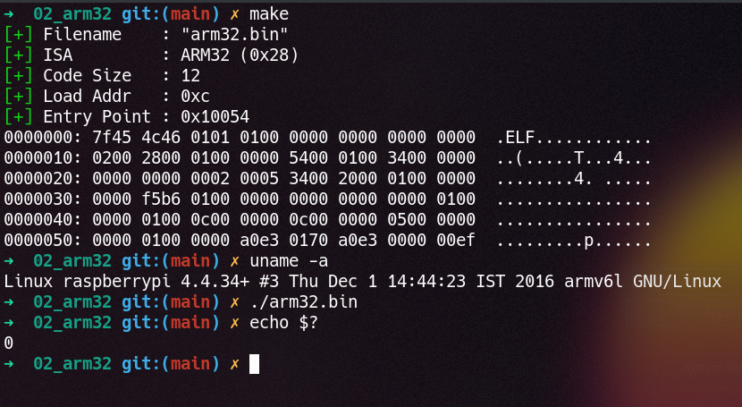

# LibGolf

## Example: ARM32

This is an example for `arm32` shellcode - tested in a Raspberry Pi VM.

### Instructions

* Build the binary with `make`
* Run `arm32.bin` on a 32-bit ARM platform (e.g. a Raspberry Pi)
* Check the return value with `echo $?` - it will be `0`



### Details

In [`shellcode.h`](./shellcode.h) is ARM shellcode which calls `sys_exit` with return value `0`.

```nasm
mov r0, #0      @ Return value '0'
mov r7, #1      @ SYS_EXIT
svc #0          @ Interrupt to svc mode (syscall)
```

This gives the bytes `00 00 a0 e0 01 70 a0 e3 00 00 00 ef`, and forms the `.text` segment of the binary (see from offset `0x54` onwards below).

> Note that the bytes of each instruction are *reversed* for arm32 platforms.

```xxd
00000000: 7f45 4c46 0101 0100 0000 0000 0000 0000  .ELF............
00000010: 0200 2800 0100 0000 5400 0100 3400 0000  ..(.....T...4...
00000020: 0000 0000 0002 0005 3400 2000 0100 0000  ........4. .....
00000030: 0000 0000 0100 0000 0000 0000 0000 0100  ................
00000040: 0000 0100 0c00 0000 0c00 0000 0500 0000  ................
00000050: 0000 0100 0000 a0e3 0170 a0e3 0000 00ef  .........p......
```

### Customizations

|Field|Value|Reason|
|-|-|-|
|`e_flags`|`0x5000200`|`Version5 EABI, soft-float ABI`|
